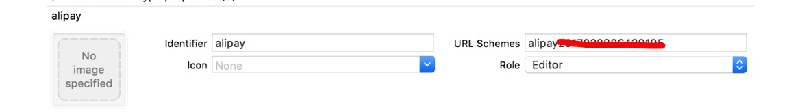

# 常用的三方库

## UI库

> [ant](https://mobile.ant.design)


## 启动页
解决启动白屏， 这个可以在启动时设定一张图片，，在数据加载完成时，隐藏此图片，

> [react-native-splash-screen](https://www.npmjs.com/package/react-native-splash-screen)

```bash

yarn  add react-native-splash-screen
# 或者
npm install react-native-splash-screen --save

# link
react-native link react-native-splash-screen

```

### ^3.2.0 版本
<!-- tabs:start -->

## ** iOS **

```m

#import "AppDelegate.h"
// other
#import "RNSplashScreen.h"

- (BOOL)application:(UIApplication *)application didFinishLaunchingWithOptions:(NSDictionary *)launchOptions
{
    // ...other code
 
    // rootView 主 View 
    [RCTSplashScreen show:rootView];
    return YES;
}

```


## ** Android **
在 app/src/main/res/layout 创建 launch_screen.xml
```xml
<?xml version="1.0" encoding="utf-8"?>
<RelativeLayout xmlns:android="http://schemas.android.com/apk/res/android"
    android:orientation="vertical" android:layout_width="match_parent"
    android:layout_height="match_parent">
    <ImageView android:layout_width="match_parent" android:layout_height="match_parent" android:src="@drawable/launch_screen" android:scaleType="centerCrop" />
</RelativeLayout>
```

适配 launch_screen.png

> 未写完 

## ** js **

```js
import SplashScreen from 'react-native-splash-screen'
export default class WelcomePage extends Component {
 
    componentDidMount() {
    	// do stuff while splash screen is shown
        // After having done stuff (such as async tasks) hide the splash screen
        SplashScreen.hide();
    }
}
```
<!-- tabs:end -->


## 照相机和选择图片功能

> [react-native-image-picker](https://www.npmjs.com/package/react-native-image-picker)

### 安装

```bash
yarn add react-native-image-picker
react-native link react-native-image-picker
```

<!-- tabs:start -->

## ** iOS **

info.plist 文件中添加权限

```xml

<key>Privacy - Camera Usage Description string</key>
<string>我们需要访问您的相机，以便您正常使用拍摄、上传图片、上传头像等服务</string>
<key>Privacy - Photo Library Usage Description string</key>
<string>我们需要访问您的相册，以便您正常使用头像修改、图片上传、图片保存等服务</string>
<key>Privacy - Photo Library Additions Usage Description string</key>
<string>请允许馫美天保存您的图片到相册</string>

```

## ** Android **

在AndroidManifest.xml文件中添加权限：
```xml
<uses-permission android:name="android.permission.CAMERA" />
<uses-permission android:name="android.permission.WRITE_EXTERNAL_STORAGE"/>
```

##### ** js **

```js
import ImagePicker from 'react-native-image-picker';
/**
 *
 *
 * @param {*} [options={}]
 * @returns {Promise}
 */
export const showImagePicker = (options = {}) => {
    return new Promise((res, rej) => {
        const tmpOptions = {
            title: '请选择照片',
            cancelButtonTitle: '取消',
            takePhotoButtonTitle: '相机',
            chooseFromLibraryButtonTitle: '相册',
            cameraType: 'back',
            mediaType: 'photo',
            allowsEditing: true,
            noData: true,
            storageOptions: {
                skipBackup: true,
                path: 'images',
            },
            ...options,
        };
        ImagePicker.showImagePicker(tmpOptions, (response) => {
            console.log('Response = ', response);
            if (response.didCancel) {
              console.log('User cancelled image picker');
            } else if (response.error) {
              console.log('ImagePicker Error: ', response.error);
              rej(response)
            } else if (response.customButton) {
              console.log('User tapped custom button: ', response.customButton);
            } else {
                // response.uri
                res(response)
              // You can also display the image using data:
              // const source = { uri: 'data:image/jpeg;base64,' + response.data };
            }
        });
    })
}
```

<!-- tabs:end -->

## 图片放大缩小

> [react-native-image-zoom-viewer](https://www.npmjs.com/package/react-native-image-zoom-viewer)

```bash
yarn add react-native-image-zoom-viewer
```

```js
// 重新创建个页面   ImageShow.js,
import ImageViewer from 'react-native-image-zoom-viewer';
// 这个是做图片缓存
import { CacheImage } from 'react-native-rn-cacheimage';

/**
 * Created by sybil052 on 2017/7/6.
 * 照片大图预览
 */
import React, {Component} from 'react';
import {
    View,
    StyleSheet
} from 'react-native';
import ImageViewer from 'react-native-image-zoom-viewer';
import { CacheImage } from 'react-native-rn-cacheimage';
import { XinLoading } from '../../components';

class ImageShow extends Component {
    static navigationOptions = ({ navigation }) => {
		return {
			headerTransparent: true,
			headerStyle: {
				backgroundColor: 'transparent',
				// evevation: 0,
				borderBottomWidth: 0,
			}
		}
	}
    constructor(props) {
        super(props);
        this.state = {
            images: [],
            imageIndex: 1,
        };
    }
    componentWillMount() {
        // 上个界面传来的照片集合
        const params = this.props.navigation.state.params;
        const images = params.image;
        const pageNum = params.num || 0;
        this.setState({
            images: images,
            imageIndex: pageNum,
        });
    }

    renderImage = (props) => {
        return <CacheImage {...props}/>
    }

    loadingRender = (props) => {
        return <XinLoading/>
    }

    render() {
        return (
            <View style={styles.container}>
                <ImageViewer
                    imageUrls={this.state.images} // 照片路径
                    enableImageZoom={true} // 是否开启手势缩放
                    index={this.state.imageIndex} // 初始显示第几张
                    failImageSource={require('../../assets/img/public/default.jpg')} // 加载失败图片
                    onChange={(index) => {}} // 图片切换时触发
                    renderImage={this.renderImage}
                    loadingRender={this.loadingRender}
                    onClick={() => { // 图片单击事件
                        this.props.navigation.goBack();
                    }}
                />
            </View>
        );
    }
}

const styles = StyleSheet.create({
    container: {
        flex: 1
    }
})
export default ImageShow;

```

## 图片缓存

> [react-native-rn-cacheimage](https://www.npmjs.com/package/react-native-rn-cacheimage)

## 键盘

解决键盘弹出时 页面自适应，失去焦点 自动弹回

> [react-native-keyboard-mgr](https://www.npmjs.com/package/react-native-keyboard-mgr)

```js
import KeyBorardManager from 'react-native-keyboard-mgr'
import React, { PureComponent } from 'react'

class App extends PureComponent {
    componentDidMount() {

        // 开启
        KeyBorardManager.setEnabled(true)

        // 键盘上的工具栏
        KeyBorardManager.setEnableAutoToolbar(true)
    }
}
```

## 字体

> [react-native-vector-icons](https://www.npmjs.com/package/react-native-vector-icons)

```bash
yarn add react-native-vector-icons
react-native link react-native-vector-icons
```

```js
// 可以引入两种不同的图标
import Icon from 'react-native-vector-icons/FontAwesome'
import FontAwesome5Icon from 'react-native-vector-icons/FontAwesome5'

<Icon color="#ee1a1a" name="check-square" size={12}/> 
<FontAwesome5Icon name="square" color="#ee1a1a" size={12}/>
```

> [所有的字体图标](https://oblador.github.io/react-native-vector-icons/) [参考文章](https://blog.csdn.net/f409031mn/article/details/79522129)

## 支付宝

> [react-native-yunpeng-alipay](https://www.npmjs.com/package/react-native-yunpeng-alipay)

```bash
yarn add react-native-yunpeng-alipay
react-native link react-native-yunpeng-alipay
```
<!-- tabs:start -->

##### ** js **
```js
import Alipay from 'react-native-yunpeng-alipay';

// orderString 后台传的
// 参考参数 app_id=2017123123123&method=alipay.trade.app.pay&format=JSON&charset=utf8&sign_type=RSA2&timestamp=2019-08-17+16%3A31%3A00&version=1.0&notify_url=https%3A%2F%2Fxin-api.ctl.pub%2Fzfbcall&biz_content=%7B%22out_trade_no%22%3A%225d57bb44664cd%22%2C%22total_amount%22%3A0.01%2C%22subject%22%3A%22%5Cu652f%5Cu4ed8%5Cu6d4b%5Cu8bd5%22%2C%22product_code%22%3A%22QUICK_MSECURITY_PAY%22%2C%22timeout_express%22%3A%222h%22%7D&sign=JXDMEDE7aGjWN8
export const aliPay = (orderString, callback) => {
    Alipay.pay(orderString).then(function(data){
        if (data.length && data[0].resultStatus) {
            /*处理支付结果*/
            switch (data[0].resultStatus) {
               case "9000":
                    callback && callback('success', '支付成功')
                 break;
               case "8000":
                    callback && callback('error', '支付结果未知,请查询订单状态')
                 break;
               case "4000":
                    callback && callback('error', '订单支付失败')
                 break;
               case "5000":
                    callback && callback('error', '重复请求')
                 break;
               case "6001":
                    callback && callback('error', '取消支付')
                 break;
               case "6002":
                    callback && callback('error', '网络连接出错')
                 break;
               case "6004":
                    callback && callback('error', '支付结果未知,请查询订单状态')
                 break;
               default:
                    callback && callback('error', '支付失败')
                 break;
             }
           } else {
                callback && callback('error', '支付失败')
           }
    }, function (err) {
        callback && callback('error', '支付失败')
    });
}

```
##### ** iOS **

- 在 TARGETS/Build Phases/Link Binary WIth Libraries 添加下面模块
    - CoreMotion.framework
    - CoreTelephony.framework
    - libc++
    - libz

- 在info.plist文件 设置URL Schema， `alipay你的appid`

    

AppDelegate.m
```c
#import "AlipayModule.h"

- (BOOL)application:(UIApplication *)application openURL:(NSURL *)url sourceApplication:(NSString *)sourceApplication annotation:(id)annotation {
  ...

  [AlipayModule handleCallback: url];
  return true;
  ...
}
```
##### ** Android **

解决报错信息
```java
public class AlipayPackage implements ReactPackage {

    @Override
    public List<NativeModule> createNativeModules(ReactApplicationContext reactContext) {
        List<NativeModule> modules = new ArrayList<>();
        modules.add(new AlipayModule(reactContext));
        return modules;
    }
// 这段注释
//    @Override
//    public List<Class<? extends JavaScriptModule>> createJSModules() {
//        return Collections.emptyList();
//    }

    @Override
    public List<ViewManager> createViewManagers(ReactApplicationContext reactContext) {
        return Collections.emptyList();
    }
}
```

<!-- tabs:end -->


## 热更新

> [react-native-code-push](https://www.npmjs.com/package/react-native-code-push)

## 上传
rn-fetch-blob 解决上传问题
> 忘了是咋解决的了，


* 基础文档
    - [react-native 中文网](https://reactnative.cn/)
    - [react-native 官网](https://facebook.github.io/react-native/)

* 工具文档
    - [Ant Design Mobile](https://mobile.ant.design/)
    - [React Navigation](https://reactnavigation.org/docs/zh-Hans/getting-started.html)
    - [android启动页](http://www.jianshu.com/p/da658aceeb44)


## 错误

`Attempted to register RCTBridgeModule class RNSplashScreen for the name 'SplashScreen', but name was already registered by class RCTSplashScreen`

我引入了两个 SplashScreen react-native-splash-screen 和 @remobile/react-native-splashscreen ， 删除一个react-native-splash-screen，

xcode > Build Phases > LinkBinary With Libraries 删除 react-native-splash-screen相关
xcode > Build Settings > Header Search Paths、Library Search Paths、 Framework Search Paths 删除 react-native-splash-screen相关

其他情况类似

